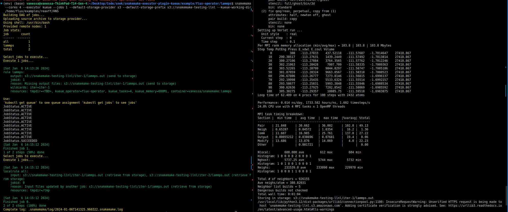

# Flux Operator Workflow

Given that you've installed Kueue (see the main [README](../README.md)) and have snakemake locally, you can
first install the Flux Operator. Note that we are installing a [development branch](https://github.com/flux-framework/flux-operator/issues/211):

```bash
kubectl apply -f https://raw.githubusercontent.com/flux-framework/flux-operator/test-refactor-modular/examples/dist/flux-operator-refactor.yaml
```

You will still need to choose a storage provider (for lammps output files). Note in the [Snakefile](Snakefile) that we are using the container
as a launcher, meaning that our command is going to need to have flux commands in it (e.g., submit, run). This allows you more freedom to
customize how you want the job to be. When you are ready:

```bash
snakemake --cores 2 --executor kueue --jobs 1 --default-storage-provider s3 --default-storage-prefix s3://snakemake-testing-llnl --kueue-working-dir /home/flux/examples/reaxff/HNS
```

Note that we can set the global working directory because there is just one step with lammps (that uses that). If you needed this on the level of the step, you
could define it as a kueue attribute instead in the Snakefile. Also note that the container here is built from the [Dockerfile](Dockerfile):

```bash
docker build -t vanessa/snakemake:lammps .
```

At the time of development, the steps provided by snakemake to install are not flexible to different (older) versions of Python. Also note that we are using the flux refactor branch (not merged yet).
Here is the first successful run!



When you are done, clean up:

```bash
kind delete cluster
```